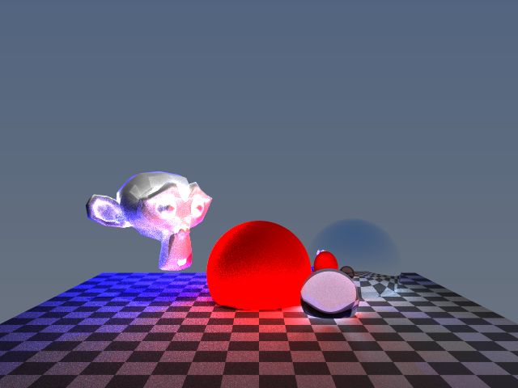

# rays

### Ray's Ray Tracer - A (Forever In-progress) Monte Carlo Path Tracing Renderer

**2019/08/08** - Project still needs a lot of work and I haven't worked on it in a while, but I need to open-source this repo for reasons.

## Features
- **Currently:** 3.2 million rays/second
- Multi-threaded tile-based rendering
- Bounding Volume Hierarchy (BVH) as an acceleration structure
- Procedural texturing
- Wavefront OBJ file parsing and rendering 
- Lambertian BRDF
- Stratified sampling
- Math (vectors, matrices), high-resolution timing, memory arena allocator and more via [raywan/rw](https://github.com/raywan/rw)

## Screenshot

- Suzanne and 3 Spheres (2048spp, max depth of 3)

  

## Building

This project supports Windows, Mac and Linux and uses [Ninja](https://ninja-build.org) for building. There's also a `build.bat` file for Windows.

```
python configure.py
ninja
```

## Dependencies

- [raywan/rw](https://github.com/raywan/rw) - everything
- [nothings/stb](https://github.com/nothings/stb) - stb_image_writer.h

## Resources

- [PBRT](http://www.pbr-book.org/)